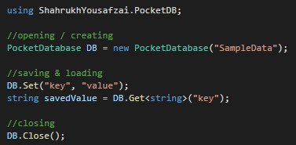

# PocketDB
PokcetDB is a solution for windows that provides the simplicity of Json.net without sactificing scalability and versatility. With this asset you will get going with just 4 lines of code!

</b><b>Easy to use</b>

The backbone of this asset is a lightweight database, which allows it to shine the brightest when it matters the most: when the save files are big and threaten to become a bottleneck for your application. But this asset is more than just a faster solution; you will be able to split your app data into different files, providing a simple, reliable and well-organized solution for your needs.

To be able to save any kind of object into the database, PocketDB uses Newtonsoft Json.NET. That will allow you to serialize and store any kind of object and recover it effortlessly.

✓ WPF  
✓ Windows Forms  

<b>Would really appreciate if you want to improve PocketDB. Just Pull request for it :)</b> 
   
Contact me at shahrukhyousafzaiofficial@gmail.com for any kind of information. Thanks! :) 
